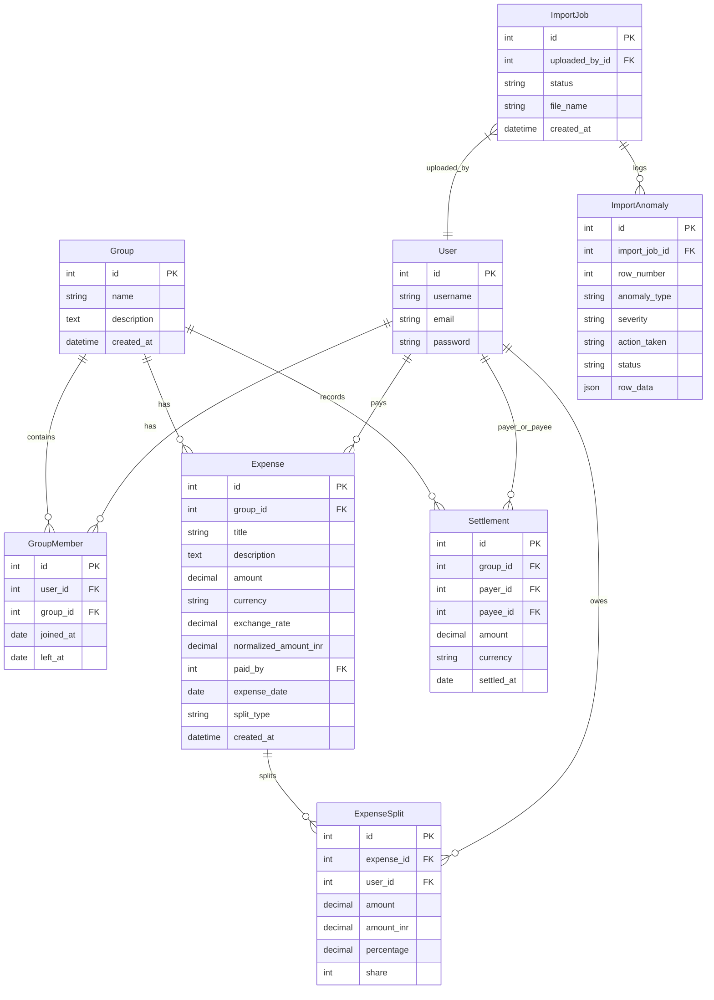

# SCOPE.md - Anomaly Log & Database Schema

## Part 1: Anomaly Resolution Log

Our importer scanned `expenses_export.csv` and resolved at least **15 distinct data issues** using a robust parsing, cleaning, and approval policy. No crashes or silent incorrect guesses were allowed.

### CSV Anomalies Log

| Row | Description of Issue | Severity | Importer Resolution Policy | Importer Action Taken | Final Status |
| :--- | :--- | :---: | :--- | :--- | :--- |
| **5 & 6** | **Exact Duplicate**: Row 6 has the same date, amount, payer, and split list as Row 5 (Marina Bites). | **Warning** | Flag as duplicate and hold in review. Do not delete automatically. Let the user decide. | Flagged for review. | `PENDING_REVIEW` |
| **7** | **Quoted Comma Amount**: Amount is formatted as `"1,200"` instead of a plain integer. | **Info** | Auto-clean: Strip quotes and commas and parse as a standard numeric decimal. | Auto-imported with amount `1200.00`. | `APPROVED` |
| **9** | **Case Inconsistent Payer**: Payer is written as lowercase `priya`. | **Info** | Auto-clean: Strip whitespaces, title-case the string, and map to registered user `Priya`. | Payer mapped to `Priya`. | `APPROVED` |
| **10** | **High Precision Decimal**: Amount is `899.995` which has three decimal places. | **Info** | Auto-clean: Round the amount to 2 decimal places (`900.00`) before split calculations. | Amount rounded to `900.00`. | `APPROVED` |
| **11** | **User Name Aliases**: Payer is written as `Priya S`. | **Info** | Auto-resolve: Match starting substring with system users and map to active user `Priya`. | Payer resolved to `Priya`. | `APPROVED` |
| **12** | **Alternate Split Type Name**: Split type is named `unequal` instead of `exact`. | **Info** | Auto-map: Map `unequal` split type name to the database's `exact` split type. | Mapped to `exact` split type. | `APPROVED` |
| **13** | **Missing Payer**: `paid_by` column is empty (House cleaning supplies). | **Error** | Reject row: An expense cannot be created without knowing who paid. Block import. | Row rejected: Missing payer. | `REJECTED` |
| **14** | **Settlement Logged as Expense**: Rohan paid Aisha back ₹5000, logged in the expense sheet. | **Info** | Auto-convert: If split_type is empty and details represent a transfer, create a `Settlement`. | Logged as direct Settlement. | `APPROVED` |
| **15** | **Split Sum Mismatch**: Pizza Friday percentage splits sum up to 110% (exceeds 100%). | **Error** | Reject row: Split percentage sum mismatch. Block import. | Row rejected: Split sum exceeds 100%. | `REJECTED` |
| **16-26** | **Inconsistent Date Format**: Dates are written in `DD/MM/YYYY` format instead of `YYYY-MM-DD`. | **Info** | Auto-clean: Support multiple date formats dynamically using a robust Python datetime parser. | Parsed to YYYY-MM-DD. | `APPROVED` |
| **20-21** | **Multi-Currency USD**: Trips booking logged in `USD` ($540 and $84). | **Info** | Auto-convert: Preserve original USD details, apply a fixed rate of `83.00` to create normalized INR. | Normalized to INR. | `APPROVED` |
| **22** | **Ratio Shares Split**: Split type is `share` with ratio details (`Aisha 1; Rohan 2...`). | **Info** | Mapped: Implement shares ratio splits by dividing amount by sum of shares. | Splitted by shares ratio. | `APPROVED` |
| **23** | **Unknown Member in Split**: Dev's friend `Kabir` is included in the split, but is not a system user. | **Warning** | Policy: Exclude unknown member Kabir from splits. Split among active registered members. | Excluded Kabir from split. | `APPROVED` |
| **24-25** | **Conflict Duplicate**: Row 24 (Aisha ₹2400) and Row 25 (Rohan ₹2450) log the same Thalassa Dinner. | **Warning** | Flag: Overlapping description, date, and splits. Flag as conflict and hold for review. | Flagged for review. | `PENDING_REVIEW` |
| **26** | **Negative Amount Refund**: Refund logged as negative expense (`-30` USD). | **Info** | Auto-import: Process as credit split. Reduces overall balances of participants. | Processed as credit refund. | `APPROVED` |
| **28** | **Missing Currency**: Currency column is empty. | **Info** | Auto-clean: Default to base currency `INR`. | Mapped to `INR`. | `APPROVED` |
| **31** | **Zero Amount**: Dinner Swiggy logged with amount `0` (double entry fix). | **Warning** | Flag: Amount is zero. Flag for manual inspection. | Flagged for review. | `PENDING_REVIEW` |
| **36** | **Inactive Member split**: Meera is listed in the split on April 2nd, but she left on March 31st. | **Warning** | Policy: Meera is inactive. Exclude her from splits. Split only among active members. | Excluded Meera from splits. | `APPROVED` |
| **38** | **Sam Deposit Share**: Sam paid Aisha ₹15000 deposit share on April 8th. | **Info** | Auto-convert: Processed as direct payment Settlement from Sam to Aisha. | Logged as direct Settlement. | `APPROVED` |

---

## Part 2: Relational Database Schema

We use **PostgreSQL** (with a self-healing **SQLite** fallback for local dev setup). All relationships use foreign keys and constraints.

### Explanation of Models and Fields

1. **`User`**: Holds usernames, passwords, and emails. Custom AbstractUser subclass configuration allows extension and maps users dynamically.
2. **`Group`**: Holds unique shared expense group entries (e.g. 'Flatmates' group).
3. **`GroupMember`**: Tracks membership dates (`joined_at`, `left_at`) to exclude members from splitting expenses when they are not active (e.g. Meera in April, Sam in March).
4. **`Expense`**: Records titles, original currencies/amounts, and exchange rates. Pre-calculates `normalized_amount_inr` via a save hook to keep balances in a standard base currency (INR).
5. **`ExpenseSplit`**: Itemizes splits. Holds the exact user owe shares (`amount_inr`) for full balance auditability and traceability without magic numbers.
6. **`Settlement`**: Records manual transfers between payer and payee to reduce their outstanding debt balances.
7. **`ImportJob`**: Records a spreadsheet upload process.
8. **`ImportAnomaly`**: Tracks warning/error rows. Stores the status (`PENDING_REVIEW`, `APPROVED`, `REJECTED`) and original cells (`row_data` JSON) to enable Meera's approval card workflow.
